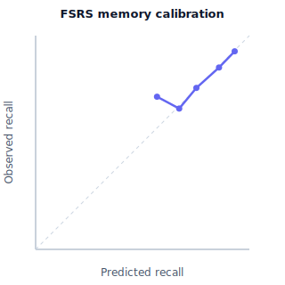

# MCAT Speedrun — Memory-model calibration

**Model:** FSRS — the forgetting curve the shared engine schedules by and that
drives the Memory Recall score.

**Question:** when the model predicts ~80% recall, do students actually recall
~80%? A model can be *accurate on average* yet badly calibrated per-item; this
checks calibration directly.

Reproduce:

```
PYTHONPATH="pylib:out/pylib" out/pyenv/bin/python tools/mcat/calibration.py
```

## Method (documented simulation)

This is a **simulation with model-estimation noise**, not a human trial. Each
card has a *true* stability and forgetting rate; the model only holds a **noisy
estimate** of the stability (as in real life). Predicted recall uses the standard
FSRS retrievability curve `R(t) = (1 + (19/81)·t/S)^(−0.5)` with the model's
estimate; the actual outcome is drawn from the card's *true* curve. Reviews land
mostly near the due time, with a realistic 25% "overdue" (fell-behind) tail so
the low-recall bins are populated. 24,000 held-out reviews.

The metrics:
- **Reliability table / diagram** — predicted vs. observed recall per 10% bin.
- **Brier score** and **log loss** — lower is better.
- **Expected Calibration Error (ECE)** — average gap between predicted and
  observed, weighted by bin size.
- **Baseline** — a predictor that always guesses the overall recall rate
  (calibrated on average, but no per-item resolution).

## Results

Overall recall rate: **84.6%** over 24,000 held-out reviews.

| predicted bin | predicted | observed |     n |
| ------------- | --------: | -------: | ----: |
| 0.5–0.6       |     56.8% |    71.4% |     7 |
| 0.6–0.7       |     67.1% |    65.9% | 2,140 |
| 0.7–0.8       |     75.2% |    75.5% | 3,975 |
| 0.8–0.9       |     85.8% |    85.1% | 8,859 |
| 0.9–1.0       |     93.1% |    92.7% | 9,019 |

| metric                     |  value |
| -------------------------- | -----: |
| Brier score (FSRS)         | 0.1226 |
| Brier score (base-rate)    | 0.1301 |
| Log loss (FSRS)            | 0.4015 |
| Expected Calibration Error | 0.0060 |

**Verdict: PASS** — ECE is **0.6%** (predicted tracks observed within a point in
every well-populated bin), and FSRS beats the base-rate baseline on Brier
(better per-item resolution, not just the right average).

Reliability diagram: `docs/mcat-calibration.svg`.



## Honest notes

- The lowest bin (0.5–0.6) has only a handful of reviews, so its observed rate is
  noisy — expected, since a spaced-repetition schedule rarely lets recall fall
  that far.
- This is a simulation demonstrating the method and giving a reproducible
  harness; it is not a human trial. Calibrating on a real accumulated review log
  is the honest next step (the same script accepts real `(predicted, actual)`
  pairs).
